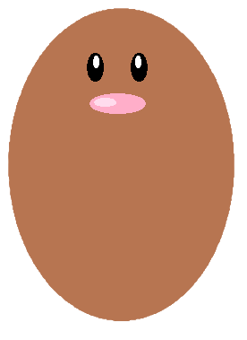

# 報告

## 說明

### 這個程式完全是自行創作的，沒有修改自任何人的程式碼，也沒有用到外部套件

### CSS
* 使用display的inline/none控制物件消失出現
* 使用position來放置物件位置
* 使用border-radius呈現圓形
* 使用overfloat隱藏超出的圖片

### HTML
* 使用button觸發事件
* 使用mouseup觸發事件

### JS
* 使用Math.floor/Math.random取得亂數
* 使用setinternal取得時間/執行函式
* 使用setTimeout執行函式
* 使用addEventListener加入多個函式
* 使用函式控制display的消失出現
* 使用alert時間到時跳出提示
* 使用innerHTML改變裡面的字
* 利用if/else控制圖片上下移動
* 利用clearInterval控制函式
* 利用clearTimeout控制函式
* 利用src改變圖片

<hr/>

## 程式碼(取其中一個)

### CSS
```
body{
    background-color:rgb(50, 202, 83);
}
h{
    font-size: 50px ;
    color: white;
    padding-left: 0px;
    padding-right: 50px;
    padding-top: 50px;
     padding-bottom: 50px;
}
button{
    display: inline;
    padding-top: 0px;
}
p{
    display: none;
    color: white;
    font-size: 25px;
    padding: 50px;
}
div.box{
    clear: both;
    display: table;
}
div.out1{
    float: left;
    width: 200px;
    height: 200px;
    position: relative;
    background-color: rgb(146, 105, 24);
    border-radius: 50%;
    margin-left: 100px;
     margin-top: 50px;
}
div.in{
    width: 190px;
    height: 180px;
    position: absolute;
    background-color: rgb(119, 85, 16);
     border-radius: 50%;
     margin-top: 20px;
     margin-left: 5px;
}
div.i{
    width: 180px;
    height: 160px;
    position: absolute;
    background-color: rgb(97, 66, 9);
    border-radius: 50%;
    margin-top: 20px;
    margin-left: 5px;
    overflow: hidden;
}
img{
    position: absolute;
    width: 160px;
    height: 300px;
    margin-left: 10px;
}
```

### HTML(取其中一小部分)
```
<div class="t">
    <h>Welcome to my game!!!</h>
    <button style="width: 120px ;height: 50px;font-size: 30px;" id="start">START</button>
    <button style="width: 120px ;height: 50px;font-size: 30px;display: none;" id="next" onclick="document.location='Wpj2.html'">NEXT</button>
    <p id="p">分數:0</p>
    <p id="count" style="font-size: 50px;"></p>
</div>
<hr>     

<div.box>
    <div class="out1">
        <div class="in">
            <div class="i">
                
            </div>
        </div>
    </div>
    <div class="out1">
        <div class="in">
            <div class="i">
                
            </div>
        </div>
    </div>
    <div class="out1">
        <div class="in">
            <div class="i">
                
            </div>
        </div>
    </div>
    <div class="out1">
        <div class="in">
            <div class="i">
                
            </div>
        </div>
    </div>
</div>
```

### JS
```
var s =document.getElementById("start");
s.addEventListener("mouseup",D);
s.addEventListener("mouseup",delay);
s.addEventListener("mouseup",dis);
var elem=document.getElementsByClassName("animate");
var x;
var id1 = null;
var id2 = null;
var v = null;
var select = 0;
var num = 0;
var y = 20;
var spe = 1000;
function dis(){
    document.getElementById("start").style.display="none";
    document.getElementById("p").style.display="inline";
    document.getElementById("count").style.display="inline";
}
function D(){
    var po = 150;
    for(var i=0;i<elem.length;i++)
        elem[i].style.top=po;
    }
function delay(){
    var a = null;
    clearInterval(a);
    a = setTimeout(delay2,100);
}
function delay2(){
    clearInterval(v);
    v = setInterval(keep,1200);
    count();
}
function keep(){
    var a =null;
    var b =null;
    clearTimeout(a);
    clearTimeout(a);
    a = setTimeout(Up,0);
    b = setTimeout(Down,spe);
}
function Up(){
    var po = 150;
    select = 0;
    x = Math.floor(Math.random()*8);
    clearInterval(id1);
    id1=setInterval(frames,1);
    function frames(){
        if(po==0 || select == 1)
            clearInterval(id1);
        else{
            po=po-5;
            elem[x].style.top=po;
        }
    }
}
function Down(){
    if(select ==0)
    {
        var po = 0;
        clearInterval(id2);
        id2=setInterval(frames,1);
        function frames(){
            if(po==150)
                clearInterval(id2);
            else{
                po=po+5;
                elem[x].style.top=po;
            }
        }
    }
}
function DD(){
    elem[x].src="6.png";
    num++;
    select = 1;
    var po = 0;
    print();
    clearInterval(id2);
    setTimeout(del,200);
    function del(){
        id2=setInterval(frames,1);
    }
    function frames(){
        if(po==150)
        {
            elem[x].src="5.png";
            clearInterval(id2);
        }
        else{
            po=po+5;
            elem[x].style.top=po;
            }
        }
    }
function count(){
    if(y===10)
        spe=700;
    document.getElementById("count").innerHTML=y;
    if(y===0)
    {
        var b = "Time's Up!!!\nYour score is " + num;
        clearInterval(v);
        alert(b);
        /*document.getElementById("start").style.display="inline";*/
        document.getElementById("next").style.display="inline";
        document.getElementById("p").style.display="none";
        document.getElementById("count").style.display="none";
    }
    else
    {
        setTimeout(count,1000)
        y=y-1;
    }
}
function print(){
    document.getElementById("p").innerHTML="分數:"+num;
}
```